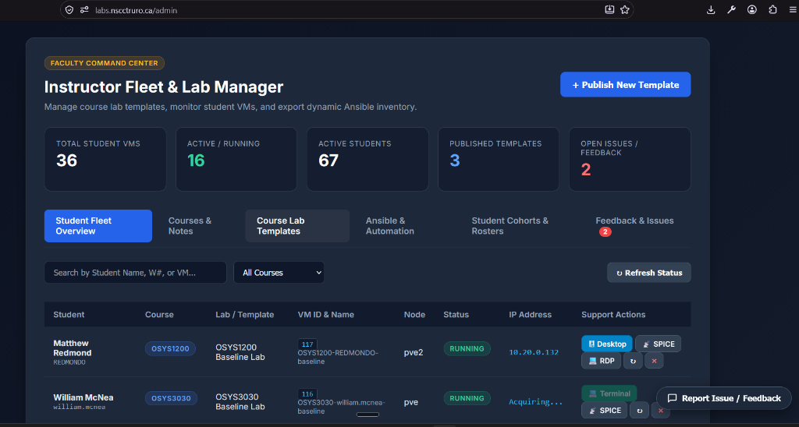
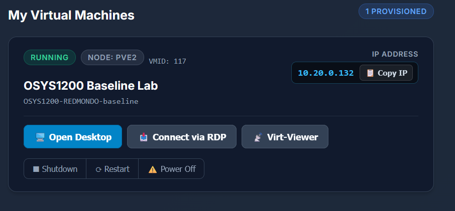
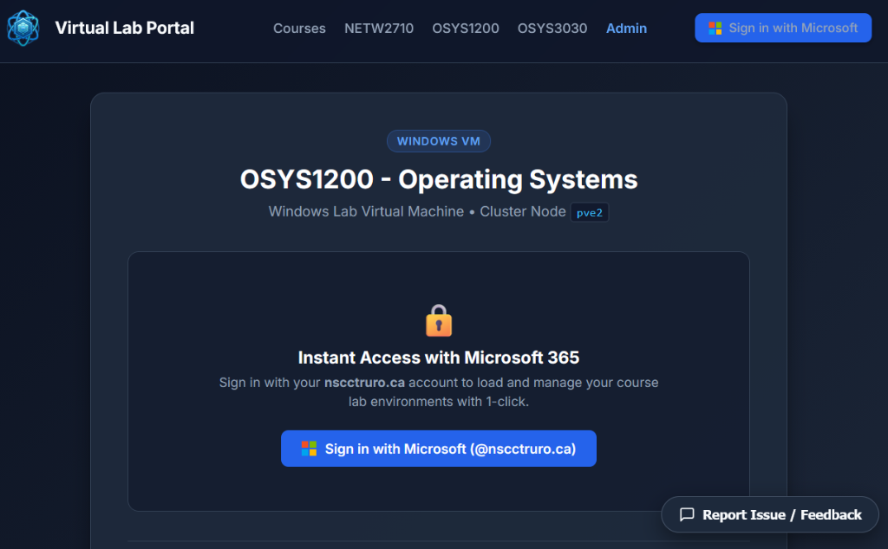

# NSCC Lab Portal (`nscc-lab-portal`)

Multi-course, self-service cloud portal for NSCC students and faculty to provision, manage, and connect to dedicated Proxmox virtual lab machines.

Built for **OSYS1200 (Operating Systems)** with multi-course support (including **NETW2710**).

> 📘 **Full Architecture Documentation**: For the detailed 8-layer technology stack breakdown, network topology diagrams, and sequence flows, see [**docs/ARCHITECTURE.md**](docs/ARCHITECTURE.md).

---

## Screenshots

<p align="center">
  
  <br>
  <em><strong>Faculty Command Center:</strong> Real-time fleet overview, cluster node distribution, dynamic IP detection, and live VM lifecycle controls.</em>
</p>

<p align="center">
  
  <br>
  <em><strong>Student Portal:</strong> Self-service VM dashboard with 1-click provisioning, quick IP copy, HTML5 browser desktop, native RDP, and SPICE console.</em>
</p>

<p align="center">
  
  <br>
  <em><strong>Single Sign-On:</strong> Zero-friction Microsoft 365 / Entra ID login enforcing college tenant authentication and course enrollment checks.</em>
</p>

---

## Key Features

- **Self-Service Student Dashboard**:
  - One-click VM provisioning with real-time progress indicators.
  - Power lifecycle controls (Start, Shutdown, Reset) with live status updates.
- **Dual Remote Connection Options**:
  - **In-Browser HTML5 Desktop**: Embedded Apache Guacamole client over WebSockets for instant desktop access without client software.
  - **Direct Native RDP**: Dynamic `.rdp` file generator configured with the VM's live Lab IP for low-latency local Layer 2 connections from physical classroom PCs.
  - **SPICE Console**: Virt-Viewer `.vv` configuration generation for low-level console diagnostics.
- **Enterprise Identity & LMS Integration**:
  - **Microsoft Entra ID (Azure AD)**: Seamless single sign-on with multi-tenant domain hints.
  - **Brightspace (D2L) LMS Sync**: Automated cohort roster synchronization via `sync_cohorts.py`.
- **High-Performance Infrastructure**:
  - **Ceph Distributed Storage**: Instant linked cloning (< 10 seconds), shared templates across nodes, and live migration.
  - **UniFi VLAN Segmentation**: Isolated `Prod` (VLAN 10) and `Lab` (VLAN 20) networks with 802.1Q tagged trunks and optimized local routing.
  - **Ansible Automation**: Automated golden template preparation (`ansible/`) over WinRM HTTPS.

---

## Technology Stack Summary

| Layer | Technologies |
| :--- | :--- |
| **Frontend** | Modern HTML5/CSS3, Jinja2 Templates, Apache Guacamole JS |
| **Backend** | Python 3.11, Flask, SQLAlchemy (SQLite ORM), MSAL |
| **Remote Gateway** | Apache Guacamole (`guacd`), Custom Async Python Guac-Bridge |
| **Virtualization** | Proxmox VE 9.2.x Cluster (`pve`, `pve2`), `proxmoxer` API |
| **Storage** | Ceph Distributed Storage (`Ceph_VM_Storage` RBD pool) |
| **Networking** | UniFi USW-48 / USW-Aggregation, VLANs (10, 20), 802.1Q Trunks |
| **Configuration** | Ansible, WinRM HTTPS (5986), PowerShell |
| **Deployment** | Docker & Docker Compose, Traefik Reverse Proxy |

---

## Configuration

Copy `.env.example` to `.env` and configure your credentials:

```bash
# Proxmox Cluster Settings
PROXMOX_HOST=10.10.0.11
PROXMOX_API_USER=root@pam
PROXMOX_API_TOKEN_ID=getvm
PROXMOX_API_TOKEN_SECRET=your-token-secret
PROXMOX_SPICE_PORT=3128

# Entra ID (Azure AD) Authentication
ENTRA_CLIENT_ID=your-client-id
ENTRA_CLIENT_SECRET=your-client-secret
ENTRA_TENANT_ID=your-tenant-id
REDIRECT_URI=https://labs.nscctruro.ca/auth/callback
```

### Course Configuration

Courses and templates are defined modularly in `config/courses.json`:

```json
{
  "courses": {
    "osys1200": {
      "id": "osys1200",
      "code": "OSYS1200",
      "name": "OSYS1200 - Operating Systems",
      "template_vmid": 2002,
      "preferred_node": "pve2",
      "os_type": "windows",
      "supports_rdp": true,
      "supports_spice": true,
      "default_username": ".\\Student"
    }
  }
}
```

---

## Template Preparation (Ansible)

To prepare a new Windows VM before converting it to a Proxmox template, see the instructions in the [**`ansible/`**](ansible/README.md) directory:

```bash
# Inside the VM: run Bootstrap-WinRM-Ansible.ps1
# On the Ansible control node:
cd ansible
cp hosts.yml.example hosts.yml
ansible-playbook vm-template-prep.yml -l osys1200-template-2002 -k
```

---

## Deployment (Docker Compose)

On the production Docker host (`10.10.0.103`):

```bash
# Clone or pull latest repository
cd ~/proxmox-getvm-app
git pull

# Build and launch multi-container stack
sudo docker compose build proxmox-app
sudo docker compose up -d
```

---

## Repository & Security Hygiene

This project enforces strict privacy and PII protection protocols:
* No hardcoded passwords, tokens, or personal identifiers in code or commit history.
* Live inventories (`hosts.yml`), secrets (`.env`), and session databases are gitignored.
* Follows conventional commits (`feat:`, `fix:`, `docs:`, `chore:`).
