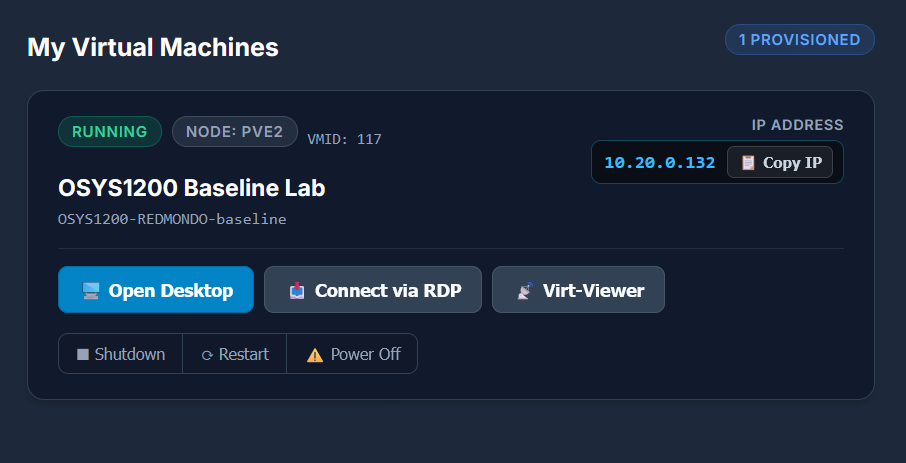

# OSYS1200 – Getting Into Your Lab VM

Each of you has your own Windows 11 virtual machine (VM) for this course. This guide gets you connected in about 5 minutes.

---

## In the Lab (Today)

You're already on the lab network, so there's nothing to install.

### 1. Sign in to the Lab Portal

1. Open a web browser and go to **https://labs.nscctruro.ca**
2. Click **Sign in with Microsoft** and use your **@nscctruro.ca** account.
3. Pick **OSYS1200** from your course list.

### 2. Find Your VM

You'll see a card like this:

- If you **don't** have a card yet, click **Provision Lab VM** and wait 15–30 seconds.
- Make sure the green badge says **RUNNING** and an **IP address** (10.20.x.x) is showing. If it says stopped, start it and give it a minute to get an IP.

### 3. Connect via Remote Desktop (recommended)

1. Click **Connect via RDP**. A small `.rdp` file downloads.
2. Open the downloaded file.
3. If Windows warns about an *unknown publisher*, click **Connect**.
4. A **Windows Security** box asks for your password. The username (**Student**) is already filled in.
   - Enter the password your instructor gives you in class.
   - Under the username, you may see *your own computer's name* followed by `\Student` (for example `DESKTIPS-123456\Student`). **That's normal.** Just enter the password.
   - Leave **Remember me** unchecked on shared lab computers.
5. If you get a warning that *the identity of the remote computer cannot be verified*, click **Yes**.

You're in. Your VM's desktop fills the screen.

> **Can't get RDP to work?** Click **Open Desktop** instead. It opens your VM right in the browser, with nothing to install.

---

## When You're Done

Click **Shutdown** on your VM card, or shut down from the Start menu inside the VM.

- Your files are **saved**. Everything will be where you left it next time.
- Use **Power Off** only if the VM is frozen. It's like pulling the plug.

---

## Working From Home (Optional)

Off campus, your computer can't reach the lab network until you install **Cloudflare WARP**. This is a one-time setup.

1. **Install WARP**
   - **Windows:** open PowerShell and run `winget install Cloudflare.Warp`, or download it from **https://1.1.1.1**
   - **Mac:** download from **https://1.1.1.1**
2. **Join the NSCC Truro team**
   - Open WARP, then **Settings (gear) → Preferences → Account → Login with Cloudflare Zero Trust**
   - Team name: **`nscctruro`**
   - Enter your **@nscctruro.ca** email, then type the 6-digit code emailed to you.
3. **Turn WARP on.** The switch should say **Connected**.
4. Follow **steps 1–3 above**, exactly like in the lab.

Turn WARP off when you're done with labs if you like. It's only needed to reach your VM.

---

## Quick Fixes

| Problem | Try this |
|---|---|
| **Connect via RDP** button is greyed out | Your VM has no IP yet. Wait a minute and refresh the page. |
| RDP says *"can't connect"* or times out | Check the VM says **RUNNING**. At home, check WARP says **Connected**. |
| *"Your credentials did not work"* | Retype the password carefully (it's case-sensitive). Otherwise, use **Open Desktop**. |
| Black screen / VM stuck booting | Click **Virt-Viewer**, or ask your instructor. |
| Portal says *no enrolled courses* | Tell your instructor so they can add you. |

Still stuck? Use the **💬 Report Issue / Feedback** button in the bottom-right corner of the portal, or put your hand up.
