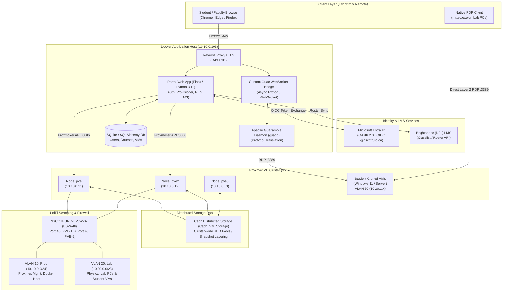
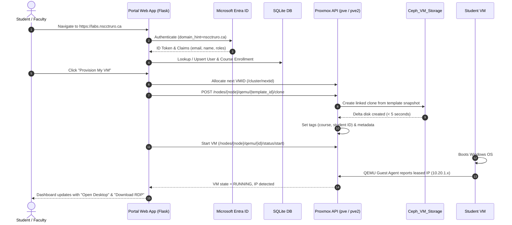

# NSCC Lab Portal — Full Stack Architecture & Technical Reference

This document provides a comprehensive technical overview of the architecture, stack layers, network topology, storage design, and operational workflows powering the **NSCC Lab Portal** (`https://labs.nscctruro.ca`).

---

## 1. High-Level System Architecture

---

## 2. The 8-Layer Technology Stack

### Layer 1: Frontend & User Interface
* **UI Framework**: Modern responsive HTML5, CSS3, and JavaScript styled with dark-mode glassmorphic aesthetics.
* **Server-Side Templates**: Jinja2 rendering dynamic student self-service dashboards, administrative consoles, and course landing pages.
* **In-Browser Remote Desktop**: **Apache Guacamole Client** (`guacamole-common-js`) rendering interactive remote desktops directly on HTML5 `<canvas>` over low-latency WebSockets.
* **Desktop Launchers**:
  * **Dynamic `.rdp` Generator**: Automatically generates and downloads tailored `.rdp` connection files pre-configured with the student VM's live IP, optimal screen resolutions, and audio redirection.
  * **Virt-Viewer SPICE `.vv` Generator**: Generates direct console configuration files for raw hypervisor-level graphics debugging over SPICE proxy.

### Layer 2: Application & Backend Services
* **Runtime**: Python 3.11-slim containerized with Gunicorn / Flask.
* **Core Application (`app.py`)**: REST API and MVC controller managing user sessions, template listings, VM state transitions, and role-based access control (Students vs Faculty/Admins).
* **Database & ORM**: **SQLAlchemy** on **SQLite** with automated lightweight schema upgrades. Tracks:
  * Users (Entra Object IDs, email identities, roles)
  * Courses (Course codes, branding, default templates)
  * VM Allocations (VMID, node placement, student assignment, lease timestamps)
* **API Integration Engine**:
  * **`provisioner.py`**: Proxmox cluster automation engine.
  * **`sync_cohorts.py`**: Automated LMS cohort synchronization script.

### Layer 3: Identity, Access & LMS Integration
* **Identity Provider**: **Microsoft Entra ID (Azure AD)** via MSAL (Microsoft Authentication Library).
  * Enforces `domain_hint="nscctruro.ca"` and `prompt="select_account"` to prevent multi-account browser conflicts when students are logged into personal or parent college tenants.
* **Roster Synchronization**: Integration with **Brightspace (D2L) LMS REST APIs** to pull active course enrollments, map official student email addresses, and pre-register cohort access.

### Layer 4: In-Browser Remote Gateway (Guacamole Stack)
* **`guacd` Daemon**: Standard Apache Guacamole proxy container translating browser WebSocket messages into native RDP and VNC protocols.
* **Custom Guac-Bridge (`guac-bridge/bridge.py`)**: High-performance asynchronous Python WebSocket gateway providing:
  * Encrypted session handshake and authentication.
  * Dynamic viewport resolution negotiation and automatic scaling.
  * Bidirectional clipboard synchronization.

### Layer 5: Hypervisor & Orchestration (Proxmox VE Cluster)
* **Hypervisor Platform**: Multi-node Proxmox Virtual Environment (PVE 9.2.x) cluster:
  * `pve` (`10.10.0.11`)
  * `pve2` (`10.10.0.12`)
  * `pve3` (`10.10.0.13`)
* **Cluster Automation (`proxmoxer`)**: Communicates with Proxmox nodes over HTTPS (`:8006`) using least-privilege API tokens.
* **Provisioning Workflow**:
  1. Identifies preferred node or evaluates cluster load.
  2. Allocates next sequential VMID cluster-wide (`/cluster/nextid`).
  3. Executes linked clone from shared template (`/nodes/{node}/qemu/{vmid}/clone`).
  4. Injects metadata tags (`course;student;template`) and descriptive notes.
  5. Monitors task completion via UPID polling.
  6. Queries **QEMU Guest Agent (`qemu-ga`)** for dynamic network adapter IP leases.

### Layer 6: Distributed Storage (Ceph RBD)
* **Primary Storage Pool**: **`Ceph_VM_Storage`** (Ceph RADOS Block Device).
* **Cross-Node Capabilities**:
  * Base VM templates stored on Ceph are accessible to **every node** in the cluster.
  * **Instant Linked Clones**: Creates copy-on-write snapshot delta disks in seconds without copying base virtual disk images.
  * **Zero-Downtime Live Migration**: VMs can migrate freely between `pve` and `pve2` for load balancing or host maintenance since storage is shared.

### Layer 7: Network Architecture, VLANs & Switching
* **Switching Infrastructure**: UniFi **USW-48** (`NSCCTRURO-IT-SW-02`) connected to **USW-Aggregation** over 10 GbE SFP+ uplinks.
* **Subnet & VLAN Layout**:
  * **VLAN 10 (`Prod`, `10.10.0.0/24`)**: Proxmox cluster nodes (`.11`, `.12`), Docker host (`.103`), DNS and gateway services.
  * **VLAN 20 (`Lab`, `10.20.0.0/23`)**: Physical student stations in Lab 312 (`10.20.1.192`) and virtual student VMs (`10.20.1.x`).
  * **VLAN 99 (`Mgmt`)**: Out-of-band switch and PDU management.
* **Port Profiles on `NSCCTRURO-IT-SW-02`**:
  * **Port 40 (`PVE-1 vmbr2`)** & **Port 45 (`PVE-2 vmbr2`)**: Native network = `Lab` (VLAN 20), Tagged VLAN Mgmt = `auto` (all VLANs allowed).
  * **Direct Layer 2 Performance**: Allows physical classroom PCs on VLAN 20 to connect directly to student VMs on VLAN 20 over local Layer 2 switching with sub-millisecond latency.
* **Firewall Rules**: Stateful pinholes on UniFi Gateway permitting:
  * Port `443/80` (Web portal)
  * Port `8006` (Proxmox API)
  * Port `3128` (SPICE graphic proxy)

### Layer 8: Configuration Management & DevOps
* **Ansible Automation (`ansible/`)**:
  * Remote execution over **WinRM HTTPS (TCP 5986)** with self-signed certificate authentication.
  * **`Bootstrap-WinRM-Ansible.ps1`**: Inside-VM bootstrap script configuring listeners, firewall scoping, and `sysop` admin permissions.
  * **`vm-template-prep.yml`**: Automated playbook establishing the golden baseline (disabling sleep timeouts, setting Windows Update to notify-only, enabling RDP, disabling NLA, verifying `QEMU-GA`, flushing caches).
* **Containerization**: Multi-container Docker Compose stack on `10.10.0.103`:
  * `proxmox-app`
  * `guacd`
  * `guac-bridge`
* **Repository Hygiene**: Managed via Git/GitHub with strict `github-specialist-v2` compliance (mandatory PII scrubbing, gitignored local inventories/vaults, conventional commits).

---

## 3. Network Ports & Protocols Matrix

| Source | Destination | Port / Protocol | Purpose |
| :--- | :--- | :--- | :--- |
| Client Browser | `10.10.0.103` | TCP `443` (HTTPS) | Web Portal Dashboard & WebSocket Guacamole session |
| Lab Physical PC | Student VM (`10.20.1.x`) | TCP `3389` (RDP) | Direct native RDP session (Layer 2 within VLAN 20) |
| Client PC | Proxmox Nodes (`.11`, `.12`) | TCP `3128` (SPICE) | Virt-Viewer `.vv` graphic console proxy |
| Docker Host | Proxmox Nodes (`.11`, `.12`) | TCP `8006` (HTTPS) | Proxmoxer REST API automation & provisioning |
| Docker Host (`guacd`) | Student VM (`10.20.1.x`) | TCP `3389` (RDP) | In-browser Guacamole desktop streaming |
| Docker Host (Ansible) | Student VM / Template | TCP `5986` (HTTPS) | WinRM remote template preparation and management |
| Proxmox Nodes | Proxmox Nodes | TCP `6789`, `3300` | Ceph monitor and OSD replication traffic |

---

## 4. VM Lifecycle & Provisioning Sequence

